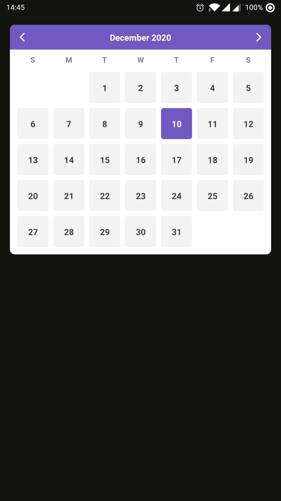

# What is this?

A simple calendar.

# Installation

`npm i @gobarber/react-native-calendar --save`

or

`yarn add @gobarber/react-native-calendar`

Then...

```
import React from 'react';
import {StatusBar, View} from 'react-native';
import Calendar from '@gobarber/react-native-calendar';

const App = () => {
  return (
    <>
      <StatusBar barStyle="light-content" backgroundColor="#131310" />
      <View
        style={{
          flex: 1,
          backgroundColor: '#131310',
          padding: 16,
        }}>
        <Calendar
          onMonthChange={(date) => console.log(date.toString())}
          onSelectDate={(date) => console.log(date.toString())}
        />
      </View>
    </>
  );
};

export default App;

```

## Options

Calendar supports some options to style the views:

```
fontFamily?: string;
colors?: {
  background?: string;
  header?: {
    background?: string;
    text?: string;
  };
  week?: {
    text: string;
  };
  day?: {
    disabled?: {
      background?: string;
      text?: string;
    };
    enabled?: {
      background?: string;
      text?: string;
    };
    highlight?: {
      background?: string;
      text?: string;
    };
  };
};
disableDays?: {
  weekDays?: Array<number>;
  days?: Array<Date>;
};
weekNames?: Array<string>;
monthNames?: Array<string>;
enabledPastDate?: boolean;
onMonthChange?: (date: Date) => void;
onSelectDate?: (date: Date) => void;
```

Week names, Month names, Colors and Font family has a default values:

```
const defaultWeekNames = ['S', 'M', 'T', 'W', 'T', 'F', 'S'];

const defaultMonthNames = [
  'January',
  'February',
  'March',
  'April',
  'May',
  'June',
  'July',
  'August',
  'September',
  'October',
  'November',
  'December',
];

const defaultColors = {
  background: '#fff',
  header: {
    background: '#7159c1',
    text: '#fff',
  },
  week: {
    text: '#7e7e7e',
  },
  day: {
    disabled: {
      background: 'transparent',
      text: '#cecece',
    },
    enabled: {
      background: '#f3f3f3',
      text: '#3f3f3f',
    },
    highlight: {
      background: '#7159c1',
      text: '#fff',
    },
  },
};

const defaultFontFamily = 'Roboto';
```


